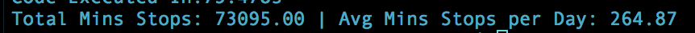
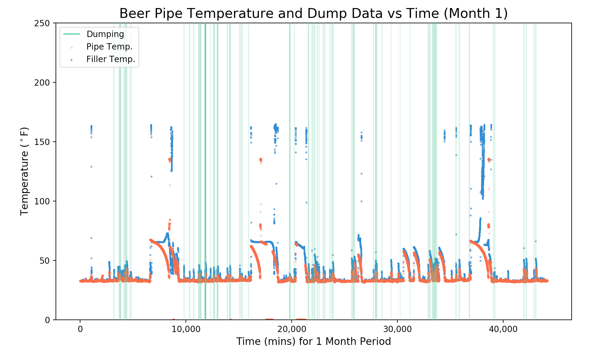

# AB Big Data

## About

Big data project for AB's can filling line. This dataset has several different parameters and each one has over 400k data points. I mainly used pandas for my workflow although using numpy could have made certains parts more efficient.

## Example(s)





## Getting Started

This program utilizes **Python3** and some common libraries/frameworks. 

Packages/frameworks needed to run on local machine:
```
- matplotlib
- numpy
- pandas
- statistics
- datetime
```

### Installing

**If you already have the packages mentioned above, you can skip this section.**

I use a Mac so the following resources for installation will be Mac specific but the same idea can be applied for Windows.

**1. Install PIP**

To get Python libraries, first install **pip** or **pip3** for Python3. For new users with Macs, this [article](http://www.pyladies.com/blog/Get-Your-Mac-Ready-for-Python-Programming/) does a good job of explaining how this is done, as well as other useful tools.

Type following into terminal:

```
$ curl -O http://python-distribute.org/distribute_setup.py
$ python distribute_setup.py
$ curl -O https://raw.github.com/pypa/pip/master/contrib/get-pip.py
$ python get-pip.py
```
**2. Install Libraries**

To install Python libraries, pip (or pip3 for Python3) will be used. 

Type the following into terminal:

```
pip install matplotlib
```

You can substitute the name of the specific library with each one mentioned earlier until completed.

### Set Up

Run L10_Dump.py

## Acknowledgments

I must tip my hat off to owners of any code, frameworks, media used that I do not own.


